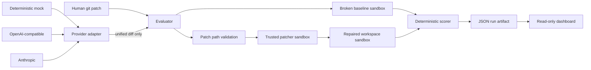

# ai-code-rescue-bench

A reproducible, inspectable benchmark for measuring how well **humans and AI coding agents diagnose and repair realistic software defects**.

This project is intentionally not an AI code-review wrapper. A model can propose a patch, but it does not decide whether the patch is correct. Correctness is scored primarily with deterministic build, behavioral, security, static-analysis, type-check, mutation, and regression checks executed inside disposable Docker sandboxes.

## Why this exists

Coding-agent evaluation is harder than asking whether a patch compiles:

- a plausible patch can pass the visible reproduction while violating an authorization boundary;
- a fix can remove a race by globally serializing unrelated work;
- a transaction fix can move an external side effect without making it atomic;
- a cache fix can invalidate too early and create a new consistency bug;
- a patch can simply modify tests unless the evaluator protects its control surface;
- repeated model trials are stochastic and model/provider versions drift;
- an untrusted benchmark repository is itself executable adversarial input.

`ai-code-rescue-bench` makes those problems visible rather than collapsing them into one opaque LLM-generated score.

## What is included

- **16 version-controlled defect cases** across Python/FastAPI, Node.js/TypeScript, React, SQL/PostgreSQL, and Docker/configuration.
- Broken repository fixtures, issue reports, expected behavioral contracts, defect metadata, visible tests, evaluator-only regression/security checks, and deterministic mock patches.
- Human patch submission and agent-generated patch modes.
- OpenAI-compatible, Anthropic, and deterministic mock providers.
- A Docker-only execution boundary for benchmark code with CPU, memory, PID, network, privilege, filesystem, and timeout restrictions.
- Baseline-before-patch execution so the score distinguishes a new regression from a defect that already existed.
- Ruff, mypy, Semgrep, Tree-sitter, ESLint, TypeScript compiler, SQL parsing, and targeted mutation-style checks where useful.
- Transparent JSON artifacts, unified patch diffs, runtime and provider token/cost metadata.
- A read-only dashboard for comparing humans, providers/models, prompts, and repeated trials.
- CI that runs repository tests plus a small deterministic benchmark subset on pull requests.

## Architecture



The host orchestrator copies files, validates diff paths, invokes the Docker CLI, and persists artifacts. **Benchmark-provided executable commands are never run directly on the host.**

## Quick start

Requirements:

- Python 3.13+
- Docker Engine / Docker Desktop
- Node.js 22+ only if you want to build the dashboard locally

```bash
python -m pip install -e '.[dev]'
make images
rescuebench doctor
rescuebench list
```

Run a deterministic demonstration without any commercial API key:

```bash
rescuebench agent py-fastapi-tenant-leak --provider mock
```

The mock provider does not pretend to be an LLM. Each case contains a deterministic reference demonstration patch so the full sandbox/evaluation/artifact path can be exercised offline. Token use and cost are recorded as zero.

Evaluate a human patch:

```bash
rescuebench evaluate py-fastapi-tenant-leak --patch ./my-fix.patch
```

Run an OpenAI-compatible provider:

```bash
export OPENAI_API_KEY='...'
export OPENAI_MODEL='your-model-id'
# Optional for a non-default compatible endpoint:
export OPENAI_BASE_URL='https://provider.example/v1'
rescuebench agent py-fastapi-tenant-leak --provider openai-compatible
```

Run Anthropic:

```bash
export ANTHROPIC_API_KEY='...'
export ANTHROPIC_MODEL='your-model-id'
rescuebench agent py-fastapi-tenant-leak --provider anthropic
```

Provider prices are not hard-coded because they change. To compute an estimated cost for a run, explicitly supply the rates used for the experiment:

```bash
export RESCUEBENCH_INPUT_USD_PER_MILLION='...'
export RESCUEBENCH_OUTPUT_USD_PER_MILLION='...'
```

If rates are not supplied, cost is stored as `null` rather than guessed.

## Dashboard

The dashboard is deliberately **read-only**. It visualizes artifacts but exposes no endpoint that accepts or executes arbitrary patches.

Terminal 1:

```bash
rescuebench serve
```

Terminal 2:

```bash
cd web
npm install
npm run dev
```

Open `http://localhost:5173`.

The dashboard shows:

- benchmark and issue description;
- original failing baseline checks;
- submitted patch and unified diff;
- build/public/hidden/security/quality/mutation/regression outcomes;
- transparent raw score and penalties;
- runtime and changed-line count;
- provider/model/prompt metadata;
- input/output tokens and cost when reported/configured;
- repeated-trial mean and range by case/provider/prompt.

## Benchmark cases

| Case | Stack | Defect | Difficulty |
|---|---|---|---|
| `py-fastapi-tenant-leak` | Python / FastAPI | tenant data leakage | hard |
| `py-async-cache-race` | Python / asyncio | race condition | expert |
| `py-transaction-outbox` | Python / PostgreSQL pattern | transaction bug | hard |
| `py-webhook-idempotency` | Python / webhooks | webhook replay / idempotency | expert |
| `py-resource-leak-stream` | Python / asyncio | resource leak | medium |
| `ts-async-foreach` | Node.js / TypeScript | async misuse | hard |
| `ts-cache-invalidation` | Node.js / TypeScript | cache invalidation | hard |
| `ts-module-compat` | Node.js / TypeScript / ESM | dependency/config incompatibility | medium |
| `ts-tenant-authorization` | Node.js / TypeScript | broken authorization | hard |
| `react-stale-effect` | React / TypeScript | incorrect state lifecycle | hard |
| `react-listener-leak` | React / TypeScript | resource/listener leak | hard |
| `sql-tenant-filter` | SQL / PostgreSQL | tenant data leakage | hard |
| `sql-n-plus-one` | Python / PostgreSQL | N+1 query | hard |
| `sql-lost-update` | SQL / PostgreSQL | lost update / transaction bug | expert |
| `docker-service-localhost` | Docker Compose / PostgreSQL | network configuration | medium |
| `docker-healthcheck-readiness` | Docker Compose / PostgreSQL | readiness/startup ordering | hard |

The benchmark favors a small set of cases with different failure mechanisms over hundreds of syntactic variants.

## Case format

Every `benchmarks/<case-id>/` contains:

```text
case.yaml                 # contract, metadata, sandbox and scoring checks
issue.md                  # issue shown to the repairer/provider
repo/                     # broken repository fixture + visible reproduction
  tests/                  # visible tests where applicable
tests_hidden/             # evaluator-only checks mounted outside /workspace
mock.patch                # deterministic offline demonstration patch
```

The provider receives `issue.md`, the expected behavioral contract, and a text snapshot of `repo/`. It does **not** receive `tests_hidden/` or `mock.patch` through the benchmark provider context.

Because this is an open-source benchmark, those evaluator files are naturally readable by a person browsing GitHub. “Hidden” here means **withheld from the evaluated attempt and mounted outside the writable workspace**, not a claim of cryptographic secrecy. A competitive hosted leaderboard should add a private holdout pack that is never published.

## Scoring

A case declares weighted non-regression checks totaling 100 points. A typical case includes:

- build/typecheck: 10
- public reproduction: 20
- hidden behavioral checks: 35
- security checks: 15
- static/lint/type quality: 10
- mutation/adversarial checks: 10

The exact manifest is authoritative.

The evaluator first runs the broken fixture to capture its baseline. It then applies the patch in a constrained patcher container and repeats the checks.

```text
raw score            = sum(weights of passing non-regression checks)
changed-lines penalty = 0.1 per changed line above the case budget, capped at 5
regression penalty    = 5 per newly failing regression check, capped at 25
final score           = clamp(raw - penalties, 0, 100)
```

A regression check that already failed on the original fixture is not charged as a newly introduced regression.

See [docs/EVALUATION.md](docs/EVALUATION.md) for the full methodology.

## Deterministic judging vs. LLM judging

The benchmark does not ask another model to decide whether a repair is correct when a deterministic test can answer the question.

LLMs are used to **generate candidate patches**, not as the primary correctness judge. If a future case genuinely needs a subjective semantic assessment, that assessment should be recorded as a separate non-authoritative signal with its prompt/model/version preserved—not silently blended into deterministic correctness.

## Sandbox design

Default execution controls include:

- a disposable `docker run --rm` container per check;
- network mode `none`;
- CPU quota;
- memory limit;
- PID limit;
- read-only container root filesystem;
- dropped Linux capabilities;
- `no-new-privileges`;
- non-root UID/GID;
- small `noexec,nosuid,nodev` tmpfs mounts;
- per-check wall-clock timeout;
- only the attempt workspace is writable;
- hidden evaluator directory is mounted read-only and outside the workspace;
- no Docker socket or host secrets mounted into evaluator containers;
- benchmark symlinks are rejected before copying;
- patches cannot modify tests, `.git`, `.github`, absolute paths, or traversals.

Docker is a useful local isolation boundary, **not a perfect hostile-code sandbox** because containers share the host kernel. For internet-facing untrusted submissions, run this worker inside a disposable VM/microVM or additional isolation layer such as gVisor/Kata and keep the Docker daemon away from unrelated workloads.

Docker/configuration benchmark cases are parsed and inspected; their candidate Dockerfiles/Compose configuration are not blindly built or launched by the evaluator.

See [docs/SANDBOX_SECURITY.md](docs/SANDBOX_SECURITY.md).

## Results and reproducibility

Every run writes:

```text
artifacts/runs/<run-id>/
  result.json
  attempt.patch
```

`result.json` preserves the case, mode, provider/model/prompt identifier, token metadata, baseline checks, repaired checks, score components, runtime, and artifact path. Hidden-evaluator stdout/stderr is redacted from the public artifact surface so the evaluator does not become an oracle for test internals.

### Sample results

This repository intentionally does **not** check in invented GPT/Claude/human leaderboard numbers. CI executes deterministic mock demonstrations and uploads the resulting run artifacts. Those are real executions of the same evaluator path and are the appropriate smoke-test sample until measured provider/human experiments are actually run.

To generate your own sample result:

```bash
make images
rescuebench agent py-fastapi-tenant-leak --provider mock --json
```

Never interpret the mock provider as a model baseline; it exists to prove that the benchmark machinery works without commercial credentials.

## Comparing models, prompts, humans, and repeated trials

```bash
rescuebench agent ts-async-foreach --provider openai-compatible --model model-a --prompt-id default
rescuebench agent ts-async-foreach --provider openai-compatible --model model-a --prompt-id concise-v2
rescuebench agent ts-async-foreach --provider anthropic --model model-b --prompt-id default
rescuebench evaluate ts-async-foreach --patch ./human.patch
rescuebench compare --limit 100
```

Run multiple trials for stochastic providers. Do not treat a one-run ranking as statistically meaningful. Model aliases can change behind the same string, temperature zero does not guarantee infrastructure-level determinism, cases are not independent samples from all software engineering, and public benchmarks can become contaminated by training or manual inspection.

Report raw runs alongside means, ranges/dispersion, exact model identifiers when available, provider date, prompt id/text, trial count, token usage, cost assumptions, and benchmark revision.

## Development

```bash
python -m pip install -e '.[dev]'
ruff check src tests tools
pytest
cd web && npm install && npm run build
```

Build all evaluator images:

```bash
./scripts/build-evaluator-images.sh
```

Validate the Docker boundary is available:

```bash
rescuebench doctor
```

## Adding a benchmark case

A good case should:

1. represent a realistic production failure with a credible issue report;
2. have a broken baseline that demonstrably fails meaningful checks;
3. require semantic reasoning rather than a one-token typo;
4. define observable behavior instead of prescribing one implementation;
5. include adversarial/security checks when the defect crosses a trust boundary;
6. include at least one regression invariant unrelated to the obvious visible failure;
7. use deterministic validators whenever possible;
8. set a changed-line budget that encourages focused repairs without forcing a particular patch;
9. avoid network access and undeclared runtime dependencies;
10. include a deterministic `mock.patch` that exercises the entire pipeline offline.

See [docs/BENCHMARK_DESIGN.md](docs/BENCHMARK_DESIGN.md).

## Documentation

- [Benchmark design](docs/BENCHMARK_DESIGN.md)
- [Sandbox security and threat model](docs/SANDBOX_SECURITY.md)
- [Evaluation and statistical limitations](docs/EVALUATION.md)
- [Architecture decisions](docs/ADRS/)

## Security

Treat all benchmark repositories and submitted patches as untrusted. Do not point the local runner at arbitrary third-party repositories unless you understand the Docker/host threat model. See [SECURITY.md](SECURITY.md) for reporting vulnerabilities.

## License

Apache-2.0. See [LICENSE](LICENSE).
